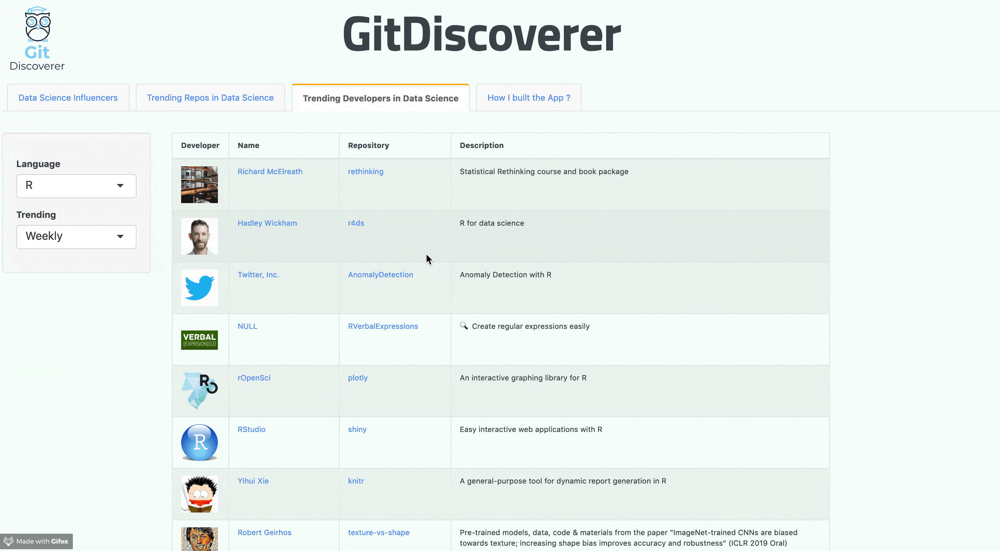

# [GitDiscoverer](https://gitdiscoverer.shinyapps.io/rstudio-shiny-contest/)

## Quick Overview

This project is a part of building a shiny app for rstudio shiny app contest. **GitDiscoverer** focuses on showing activity on github like top trending repositories, top trending developers in data science space and what influential data scientist are doing on github.

## REST APIs in USE

* [Github API](https://developer.github.com/v3/)  
* [Github Unofficial Trending API](https://github.com/huchenme/github-trending-api)  
      * [Trending Repositories](https://github-trending-api.now.sh/repositories?language=R&since=weekly)  
      * [Trending Developers](https://github-trending-api.now.sh/developers?language=R&since=weekly)

## Instructions 

In order to run this app, Github provides REST API access to get variety of the data of your projects at Github. Since we are only interested in publicly available data. We will Authenticate with OAuth 2.0 which is the most secure option. 

In order to use OAuth option, you need **Client ID** and **Client Secret**. If you don’t have them yet, go to 

1. [Github Developers settings page](https://github.com/settings/developers) , then **Oauth Applications** 
2.  **Register a new Application** say

 > Application Name: **Rstudio Shiny Contest**  
 > Homepage URL : http://github.com  
 > Application description : Rstudio 1st  shiny Contest  
 > Authorization callback URL : http://localhost:1410 

On this page, you should be able to see Client key and Client Secret. Once you have the keys put them in **global.R** of this Shiny App and make sure you have active internet connection and you're all set to run **GitDiscoverer**.

>> [More Detailed Explanation to Generate Keys at this Link](https://blog.exploratory.io/extract-data-from-private-github-repository-with-rest-api-db804fa43d84)

### **Reproducibility at RstudioCloud Server**

In order to reproduce this app at rstudio cloud server, you will need to generate oauth tokens. In my case, I was getting an error which says bad credentials and error in callback url
was error in uri redirect mismatch. Please follow the instructions at [rstudio support link](https://support.rstudio.com/hc/en-us/articles/217952868-Generating-OAuth-tokens-from-a-server) 

There are few steps to try on the ticket,  but the one which worked for me on rstudio cloud server:

> Create the .httr-oauth token on your desktop and then copy the file to a server

## App at Work
 

**Loading Screen**

  

&nbsp;

Tab 1 - **Data Science Influencer**

Please **note** if any of the username is invalid, app will throw an erorr, so make sure you enter a valid
github username.

  

&nbsp;

Tab 2 - **Trending Repositories in Data Science**

  

&nbsp;

Tab 3 - **Trending Developers in Data Science**

  

&nbsp;

## Credits

* [Shiny CheatSheet](https://shiny.rstudio.com/images/shiny-cheatsheet.pdf)  
* [DeanAttali Blog](https://deanattali.com/)  
* [Top 30 Data Scientist to follow on Github](https://www.analyticsvidhya.com/blog/2015/07/github-special-data-scientists-to-follow-best-tutorials/)  
* [Collection of Shiny Apps](https://github.com/mkearney/shinyapps_links)  
* [App Logo Design ](freelogodesign.org)  

## Contact

For any comments or questions, please email me at raj.k.stats@gmail.com
